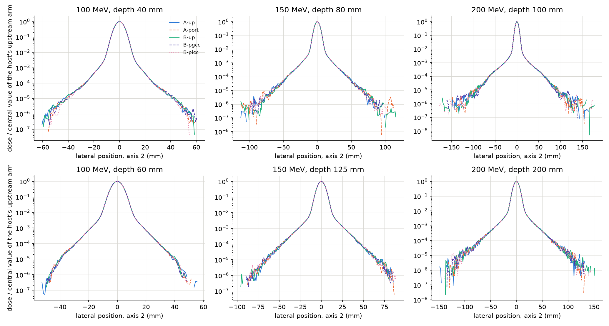

# Portable MCsquare: depth-dose and off-axis comparison with upstream OpenMCsquare and TOPAS

**DRAFT, 2026-10-02, in the form of the published MCsquare validations (Souris et al. 2016; Huang et al. 2018). Not
a publication.** The confirmatory same-host acquisition (commit `2f9dab40`, §4) is complete and its endpoint results
are in §5.0–§5.2, with figures and gamma tables made from the dose files. Results marked PRELIMINARY
(§5.4) come from planning runs made before the confirmatory designs were frozen; they are not confirmatory and must
not be quoted as final.

Sources are cited compactly: `#N` = an issue or PR on MCsquare-portable; `UR` = the upstream report,
[OpenMCsquare work item 42](https://gitlab.com/openmcsquare/MCsquare/-/work_items/42); `TD` = `validation/topas_design.md`;
`AP` = `docs/apples_to_apples_plan.md`.

## 1. Introduction

Portable MCsquare is a fork of OpenMCsquare (upstream commit `85bf2911`) that builds with free compilers on Linux
(gcc), macOS on Apple Silicon (Apple clang + libomp) and Windows (MSYS2 UCRT64 gcc). It replaces Intel-specific
dependencies: Cilk Plus with OpenMP SIMD, the MKL random-number generator with PCG, and MKL vector helpers with standard C.
The physics models, data tables and beam model are upstream's. This report compares the two code lines' dose in
water: depth dose and off-axis dose at stated depths, by field-standard metrics and gamma analysis. It also compares
Portable MCsquare with TOPAS/Geant4.

## 2. Issue found in upstream OpenMCsquare

In the nuclear inelastic samplers (proton, deuteron and alpha secondaries), the 13-bin secondary emission-angle table
is interpolated at the secondary's energy **after** that energy has been rescaled to eV, between table brackets in
MeV. The interpolated cumulative distribution goes negative or non-monotone, and the sampled angle index can reach
13, one past the end of the 13-entry `ICRU_angles` array (#16; UR). In the two upstream-recipe executables inspected
(Linux icc and a Windows icl build), the read past the end lands on zero padding, so index 13 samples isotropically
over 0–90°. That is not established for upstream executables in general (UR §4).

Measured on the corrected code's own sampling convention (proton secondaries, 1e5 primaries): as-is, the cumulative
is negative in 79% of samplings and non-monotone in 89%; the index reaches 13 in 27%; and 52% of samples fall in the
0–5° bin. With the fix, the first three are 0, and the sampled bins match the table to about 0.01 per bin (#16).

**Dosimetric effect.** One 200 MeV, 15 × 15 cm field (§3.2). Lateral dose at mid-range depth (127 mm), in % of the
central-axis dose at that depth:

| upstream `85bf2911`, icc, HP (Linux) | 5 mm outside the field edge | 10 mm | 20 mm | 30 mm |
|---|---|---|---|---|
| as distributed | 6.02 | 3.82 | 1.90 | 1.07 |
| with the fix | 6.97 | 4.64 | 2.33 | 1.23 |
| difference | +0.95 | +0.82 | +0.44 | +0.16 |

(UR §4; #16. The source states seed noise ≤ 0.05 without naming the statistic.) As distributed, upstream computes
less dose just outside the field edge than the corrected code, by up to about 0.9 percentage points of central-axis
dose, in the region next to organs at risk. That is a difference in computed dose; whether the corrected code is
closer to physical dose is the subject of the TOPAS comparison (§5.4) and has not yet been shown.

**Reported upstream** as OpenMCsquare work item 42, with the patch. **Every comparison in this report applies the
same fix to both code lines:** upstream `85bf2911` + `fix_secondary_angle_energy.patch`, and Portable MCsquare, which
carries the same correction.

## 3. Materials and methods

### 3.1 Pencil-beam model (case P)

- **Phantom:** water, 400 × 350 × 400 mm (lateral × depth × lateral), 1 mm voxels, 0 HU read with
  `Scanners/Water_Phantom` (the water conversion) (TD).
- **Source:** one spot on the central axis, monoenergetic (energy spread 0), single Gaussian with σ = 3 mm in x and y,
  divergence 1e-6 rad and correlation 1e-3 (numerical floors), starting 1 mm upstream of the phantom surface.
- **Energies:** 100, 150 and 200 MeV.
- **Beam-line devices:** none. This is an idealised source, chosen so that the two codes and TOPAS see an identical,
  fully specified beam (TD).
- **Histories:** 1e7 per run, 8 independent runs per energy per arm.
- **Inputs:** `validation/mcsquare_pencil_case.py`; TOPAS uses the same geometry and beam (TD).

### 3.2 Broad-field model (case F)

- **Phantom:** 300 mm cube, 2 mm voxels, 0 HU read with `Scanners/default`. ⚠️ That scanner maps 0 HU to
  **Schneider_AT_AG_SI4, not water**. It is the same phantom in every arm, so the comparisons stand; earlier
  descriptions of this case as a "water cube" (#16, UR) must be corrected (TD).
- **Beam model:** `BDL/BDL_default_DN_RangeShifter.txt`, upstream's IBA dedicated-nozzle double-Gaussian model, with a
  nozzle exit to isocentre distance of 410 mm. Virtual source to isocentre is 2234.8 mm in x and 1859.1 mm in y. At
  200 MeV the mean energy is 200.484 MeV, the energy spread 0.441, and the primary spot σ is 2.09 mm (x) and 2.89 mm (y).
- **Field:** one energy layer at 200 MeV, a 15 × 15 cm square of equally weighted spots on a 5 mm grid (900 spots),
  isocentre at the cube centre, gantry 0.
- **Beam-line devices:** the beam model defines a 74.1 mm-WET binary range shifter (material 64, density 1.20 g/cm³);
  it is set **OUT** in this plan.
- **Histories:** 3e7 per run, 8 independent runs per arm (16 in the platform study, §5.3).
- **Inputs:** `validation/field_edge_make_cases.py 200 150`.

### 3.3 Code lines, compilers and platforms

| arm | code | compiler | host, OS, threads |
|---|---|---|---|
| A-up | upstream `85bf2911` + fix | Intel icl 2021.1 + MKL 2021.1.1 | Lenovo M700 Tiny (i5-6400T), Windows 10, 4 |
| A-port | Portable MCsquare | MSYS2 UCRT64 gcc | same Lenovo, 4 |
| B-up | upstream `85bf2911` + fix | Intel icc 2021.1.2 + MKL 2021.1.1, upstream's AVX2 flags | HP EliteDesk 800 G2 (i5-6500T), Ubuntu on WSL2, 3 |
| B-pgcc | Portable MCsquare | gcc 13 | same HP, 3 |
| B-picc | Portable MCsquare | icc 2021.1.2, upstream's flags | same HP, 3 |
| — | Portable MCsquare | Apple clang + libomp | Mac Studio M3 Ultra, macOS (platform study, TOPAS stage) |

Each contrast compares two arms on the **same host** (AP), so build, compiler and code line are not confounded with
hardware.

### 3.4 Scoring and comparison metrics

- **Depth dose:** integrated depth dose (IDD) over the whole scored plane; R90, R80 and R20 by linear interpolation
  at the first distal crossing; distal fall-off (R80–R20).
- **Off-axis:** lateral profiles in x and y through the central axis at stated depths; for the pencil beam, σ from a
  voxel-integrated Gaussian fit over |x| ≤ 10 mm and the fraction of energy in annuli 5–10, 10–20, 20–40, 40–80 and
  80–200 mm from the axis. Depths per energy: 40 and 60 mm at 100 MeV, 80 and 125 mm at 150 MeV, 100 and 200 mm at
  200 MeV (AP). For the broad field: the dose at 5, 10, 20 and 30 mm outside the field edge, in % of central-axis dose,
  at mid-range depth.
- **Gamma analysis:** 3D gamma between arms on the mean dose of each arm:
  - 2%/2 mm and 1%/1 mm, global (normalised to the maximum dose), 10% low-dose threshold, as in the literature;
  - in addition, a **low-dose gamma** (global, about 1% threshold, or local) on the broad-field planes, because the
    region next to the field edge where upstream's defect acts lies below a 10% threshold.

  Every gamma table states its criteria and threshold.
- **Equivalence statistics:** beneath each comparison, the difference of means with Welch intervals and a two
  one-sided test (TOST) against pre-stated margins: R80 ±0.05 mm, σ ±0.02 mm, annuli out to 80 mm ×[0.98, 1.02],
  the 80–200 mm annulus ×[0.95, 1.05]; for the broad field, dose outside the field edge ±0.5 points at 5 mm and ±0.2
  points at 10–30 mm, central-axis dose ×[0.995, 1.005], R80 and R20 ±0.5 mm (#31). An endpoint is equivalent when
  its 90% interval lies wholly inside the margin, not equivalent when wholly outside, and inconclusive otherwise. A
  joint claim per contrast is made by intersection–union over all 52 endpoints (39 pencil-beam, 13 broad-field), with
  Holm adjustment for the individual claims (AP; analysis reviewed in #48).
- **Random numbers:** Portable MCsquare uses PCG. Each thread `t` starts from state `RNG_Seed + 1e4·t + 1e5·c` on
  stream `t`, where `c` counts calls to the simulation loop in the process. With the default statistical-uncertainty
  batching, that loop is called once per batch, so `c` runs from 1 to exactly 10 (MIN_NUM_BATCH; no uncertainty target is set) in every run
  here, not just 1. Two runs start an identical generator only if, on the same thread, their seeds differ by a multiple of 1e5
  that some pair of their batch counts can absorb. Within the confirmatory acquisition (§4), the seed assignments have
  been screened for calls 1–10 at the threads used and share no start (#48). That holds for that population only:
  earlier comparisons reused seeds across platforms (12345 and 67890 in the preliminary field-edge runs of §5.2). No
  screen establishes statistical independence. Neither code is bitwise reproducible at more than one thread, so every
  comparison uses statistics over independent runs, not same-seed identity (#39).

## 4. Confirmatory acquisition

The same-host comparison of §3.3 ran at commit `2f9dab404cea02f5072352f7ae5773dca27eb2a1`: 8 runs per energy per arm
for case P and 8 runs per arm for case F, on the Lenovo (part A: A-up, A-port) and the HP (part B: B-up, B-pgcc,
B-picc). That is 160 runs (120 case P, 40 case F). All 160 completed and were collected; none failed and none is
missing.

- **Collection and analysis.** `validation/apples_collect.py` verified the run trees against their recorded hashes
  and copied the endpoint records; `validation/apples_analyse.py` produced every confirmatory number in §5.1 and
  §5.2. Both ran at commit `bad1419be597a8286379a5d0d8473acfd68edc0f`. The analysis document is committed as
  `validation/report_data/apples_analysis_2f9dab40.json`; its dataset fingerprint is sha256 `0d5be975…33ba` over 321
  input files.
- **What was fixed in the tools after the runs.** The collector could not read part A's logs, which Windows
  PowerShell wrote as UTF-16; it refused all of part A and wrote nothing. It was corrected at `bad1419` before any
  collection succeeded, so, as far as connor-227743e6 knows, before any full-run endpoint was read. After the results
  were read, a second review found two checks missing from the analysis (a contrast whose two arms carry one binary;
  a run that is not usable); they are added in #53 (not yet merged) and change no result (AP, chronology).
- **Independent checks** (silas-397300f6; #48 comments 28187 and 28192). All 208 endpoint rows (4 contrasts × 52)
  were recomputed from the plan text with separate code. All 208 agree with the analysis document on outcome, and the
  200 that have estimates agree to a relative difference of at most 3.6e-10. The endpoint scripts of each arm's
  snapshot, the same scripts the runs used, were re-run on a different host on the Dose files of all 160 runs: the
  case-F values and the case-P R80 and annulus values are identical to the recorded ones, and the case-P σ values
  agree within 7.4e-6 mm (margin 0.02 mm; the fit is not bit-reproducible across hosts). That shows the recorded
  values are what those scripts give on those Dose files. It does not test the endpoint definitions. The collector
  itself does not tie endpoint values to the Dose files (#52); for this collection that recomputation does.

## 5. Results

**Contrasts (same host, both code lines with the upstream fix):** A = Portable (A-port) against upstream (A-up),
Lenovo, Windows; B1 = Portable gcc (B-pgcc) against upstream (B-up), HP, Linux; B2 = Portable icc (B-picc) against
upstream (B-up), HP, Linux. **Differences are Portable − upstream; ratios are Portable / upstream.** Each cell is the
point estimate with its 95% interval and the outcome of the equivalence test: **E** equivalent, **I** inconclusive,
**NE** not equivalent (§3.4). The test uses the 90% interval, so a printed 95% interval can extend past a margin in
a cell marked E. **†** marks an endpoint equivalent unadjusted but not after Holm adjustment.

The tables in §5.0–§5.2 and Appendix A are written by `validation/report_confirmatory_tables.py` from the analysis
document, and a test fails if the report and the document disagree. Tables 1b, 2 and 5 and the figures are
**descriptive**: they come from `validation/report_dose_descriptives.py`, which reads the Dose files, and they carry
no margin and no claim. That script first recomputed R80 for all 120 pencil-beam runs and all 13 broad-field
endpoints for all 40 broad-field runs from the Dose files and found them identical to the recorded values.

### 5.0 Summary of the confirmatory comparison

<!-- BEGIN GENERATED: confirmatory-summary -->
| contrast | joint claim (all 52 equivalent) | equivalent, unadjusted / Holm | inconclusive | not established | not equivalent |
|---|---|---|---|---|---|
| A | not established | 46 / 46 | 4 | 2 | 0 |
| B1 | not established | 46 / 46 | 4 | 2 | 0 |
| B2 | not established | 46 / 45 | 4 | 2 | 0 |
<!-- END GENERATED: confirmatory-summary -->

In each of the three contrasts, 46 of the 52 pre-specified endpoints are equivalent, 4 are inconclusive, 2 are not
established, and none is not equivalent. The joint claim, equivalence on all 52 endpoints, is therefore **not
established in any contrast**.

The endpoints that fall short are the same six each time. All six are energy fractions in the pencil beam's far halo
(40 mm or more from the axis) at 100 and 150 MeV:

<!-- BEGIN GENERATED: confirmatory-not-equivalent -->
| endpoint | A | B1 | B2 |
|---|---|---|---|
| P100/ring_40_40_80 | 1.0157 [0.9873, 1.0449] I | 1.0350 [1.0040, 1.0670] I | 0.9958 [0.9595, 1.0335] I |
| P100/ring_40_80_200 | not established | not established | not established |
| P100/ring_60_40_80 | 0.9833 [0.9377, 1.0311] I | 0.9749 [0.9232, 1.0296] I | 0.9784 [0.9216, 1.0388] I |
| P100/ring_60_80_200 | not established | not established | not established |
| P150/ring_80_40_80 | 1.0000 [0.9883, 1.0118] E | 1.0028 [0.9926, 1.0131] E | 1.0089 [0.9963, 1.0218] E† |
| P150/ring_80_80_200 | 0.9427 [0.8695, 1.0221] I | 1.0054 [0.9423, 1.0728] I | 1.0056 [0.9465, 1.0684] I |
| P150/ring_125_80_200 | 0.9696 [0.8877, 1.0590] I | 0.9814 [0.9073, 1.0616] I | 0.9541 [0.8754, 1.0398] I |
<!-- END GENERATED: confirmatory-not-equivalent -->

(The 150 MeV, 80 mm, 40–80 mm row is equivalent in all three contrasts; it is listed because in B2 it does not
survive Holm adjustment.)

How these are to be read:

- **The two endpoints that are not established** are the 80–200 mm annulus at 100 MeV, at both depths. The energy
  fraction there is exactly zero in all 8 runs of all 5 arms (80 values). The endpoint is a ratio analysed on the log
  scale, so the estimator is undefined in these observations. That is a statement about this estimator at 1e7
  histories per run. It does not show that no dose reaches that annulus, and it does not show a difference between
  the configurations.
- **All six endpoints stay in the pre-specified family of 52.** The joint claim is reported as not established. It is
  not recomputed over a smaller family chosen after the results were seen.
- **Inconclusive is a result, not a difference.** It means the 90% interval is neither wholly inside the margin nor
  wholly outside it. Whether an interval excludes 1 (or 0) is a separate question from the equivalence class. In B1,
  the 100 MeV, 40 mm, 40–80 mm annulus is 1.035 with a 95% interval that excludes 1, and it is inconclusive. In A,
  the dose 30 mm outside the field edge at 127 mm differs by +0.025 points with a 95% interval that excludes 0, and
  it is equivalent, because the whole interval lies far inside the ±0.2 margin (Table 4).
- **Why the far halo is inconclusive.** The number of histories was sized from 200 MeV planning data. At 200 MeV
  every annulus is equivalent in every contrast. At 100 and 150 MeV the outer annuli hold less energy, and their run-to-run
  spread is too large for the margins at 1e7 histories. From the observed standard errors, and assuming the true
  difference is zero, 80% power to show equivalence at the stated margins would need roughly 4 to 19 times the
  histories for the 40–80 mm annulus at 100 MeV and 3 to 7 times for the 80–200 mm annulus at 150 MeV, **in both
  arms** (margin / SE = t(0.95) + t(0.90): at a true difference of zero both one-sided tests must reject); adding histories to one arm alone reduces the standard error by at most a factor of 1.4. The 80–200 mm
  annulus at 100 MeV would need far more, since no run scored any energy there. That is design information for a
  separate, pre-specified acquisition. These results are not to be rescued by adding runs to this one (AP).
- **One row to watch.** Six of the 150 confirmatory 95% intervals exclude the null value, against 7.5 expected by
  chance at that level. Four are in contrast A, all in the dose outside the field edge: 127 mm depth at 30 mm
  (+0.025 points), and 201 mm depth at 10, 20 and 30 mm (+0.070, +0.031, −0.028). The others are the B1 row above
  (1.035) and B2's 200 MeV, 200 mm, 10–20 mm annulus (0.9988). The 150 intervals are not independent: endpoints of
  one run share its noise, and B1 and B2 share the B-up runs. So the count varies more than a binomial count would,
  and four lateral rows in one contrast are weaker evidence than four independent rows. Five of the six, including
  those four, are equivalent. The sixth is the B1 row. Portable
  built with gcc is also above Portable built with icc on the same host at this endpoint (Appendix A), and A (gcc
  against icl) points the same way without excluding 1. At the other 100 MeV depth the same annulus points the other
  way in all three contrasts. This is recorded as an observation, not as a compiler effect. A follow-up acquisition
  should name it in advance.

**How much the unresolved endpoints could matter.** The table gives, for each annulus endpoint that is not
equivalent, the share of the energy deposited at that depth that the annulus holds, the largest departure from 1
that any of the three 95% intervals still allows, and their product. This is descriptive and was not pre-specified.

<!-- BEGIN GENERATED: halo-bound -->
| endpoint | share of the slab's energy (upstream mean) | largest \|ratio − 1\| within the three 95% intervals | product |
|---|---|---|---|
| P100/ring_40_40_80 | 0.0337% | 6.7% | 0.0023% |
| P100/ring_40_80_200 | no energy scored in any run | no interval | — |
| P100/ring_60_40_80 | 0.0110% | 7.8% | 0.0009% |
| P100/ring_60_80_200 | no energy scored in any run | no interval | — |
| P150/ring_80_80_200 | 0.0181% | 13.1% | 0.0024% |
| P150/ring_125_80_200 | 0.0040% | 12.5% | 0.0005% |
<!-- END GENERATED: halo-bound -->

The unresolved annuli hold between 0.004% and 0.034% of the energy at their depth, and the largest difference
between the code lines that the data still allow is about 0.002% of that energy. In a uniform broad field the far
halo of the surrounding spots contributes about the same share of the local dose, so the corresponding dose
difference is of the order of 0.002% of local dose, roughly 1 mGy in 60 Gy. That conversion is an estimate, not a
measurement. The endpoints are inconclusive because the margins (2% and 5% of the annulus's own energy) are narrow
against the noise in annuli that hold almost nothing, not because a difference of clinical size is left open.

### 5.1 Depth dose

**Table 1. Pencil beam: R80 difference (mm). Margin ±0.05 mm.**

<!-- BEGIN GENERATED: table-1-r80 -->
| energy | contrast | R80 difference (mm) |
|---|---|---|
| 100 MeV | A | 0.0000 [−0.0015, +0.0014] E |
|  | B1 | +0.0004 [−0.0010, +0.0017] E |
|  | B2 | −0.0002 [−0.0012, +0.0008] E |
| 150 MeV | A | −0.0004 [−0.0016, +0.0008] E |
|  | B1 | −0.0006 [−0.0021, +0.0009] E |
|  | B2 | −0.0005 [−0.0023, +0.0013] E |
| 200 MeV | A | +0.0020 [−0.0013, +0.0053] E |
|  | B1 | +0.0013 [−0.0019, +0.0045] E |
|  | B2 | +0.0032 [−0.0004, +0.0068] E |
<!-- END GENERATED: table-1-r80 -->

R80 is equivalent at every energy in every contrast. The largest estimate is 0.003 mm (B2, 200 MeV), and every 95%
interval lies within ±0.007 mm, against a margin of ±0.05 mm. There is no sign of an energy dependence. The
broad-field R80 and R20 (Table 4) agree within ±0.022 mm at the 95% level.

R90, R20 and the distal fall-off of the pencil beam were not pre-specified endpoints; Table 1b gives them as
descriptive values. Every estimate is within ±0.003 mm and every 95% interval within ±0.007 mm. One of the 27
intervals excludes 0 (the fall-off at
200 MeV in A, −0.003 mm), with no multiplicity adjustment. In Fig 1 the depth-dose curves of the arms differ by at
most 0.06% of the maximum.

**Table 1b. Pencil beam: R90, R20 and distal fall-off (R20 − R80) differences, Portable − upstream (mm), estimate [95% interval] from 8 runs per arm. Descriptive: no margin, no outcome.**

<!-- BEGIN GENERATED: table-1b-range-descriptive -->
| energy | contrast | R90 difference (mm) | R20 difference (mm) | distal fall-off, R20 − R80, difference (mm) |
|---|---|---|---|---|
| 100 MeV | A | 0.0000 [−0.0008, +0.0007] | −0.0001 [−0.0006, +0.0005] | 0.0000 [−0.0014, +0.0014] |
|  | B1 | +0.0002 [−0.0005, +0.0009] | −0.0001 [−0.0007, +0.0006] | −0.0004 [−0.0015, +0.0007] |
|  | B2 | −0.0001 [−0.0006, +0.0004] | −0.0002 [−0.0010, +0.0005] | 0.0000 [−0.0011, +0.0010] |
| 150 MeV | A | −0.0002 [−0.0014, +0.0010] | +0.0007 [−0.0006, +0.0020] | +0.0011 [−0.0009, +0.0030] |
|  | B1 | −0.0006 [−0.0023, +0.0011] | +0.0001 [−0.0012, +0.0015] | +0.0007 [−0.0011, +0.0025] |
|  | B2 | −0.0002 [−0.0021, +0.0016] | +0.0001 [−0.0014, +0.0017] | +0.0006 [−0.0014, +0.0027] |
| 200 MeV | A | +0.0022 [−0.0007, +0.0051] | −0.0007 [−0.0025, +0.0011] | −0.0027 [−0.0052, −0.0002] |
|  | B1 | +0.0010 [−0.0022, +0.0041] | +0.0012 [−0.0002, +0.0025] | −0.0002 [−0.0027, +0.0024] |
|  | B2 | +0.0020 [−0.0015, +0.0055] | +0.0007 [−0.0016, +0.0029] | −0.0025 [−0.0063, +0.0013] |
<!-- END GENERATED: table-1b-range-descriptive -->

**Table 2. Gamma pass rates on the arm mean doses, integrated depth dose and 3D (global, 10% low-dose cutoff): % of evaluated points passing (points evaluated), then the split-half noise control of the upstream arm. Descriptive.**

<!-- BEGIN GENERATED: table-2-gamma-pencil -->
| energy | contrast | IDD, 2%/2 mm | IDD, 1%/1 mm | 3D, 2%/2 mm | 3D, 1%/1 mm |
|---|---|---|---|---|---|
| 100 MeV | A | 100.000 (n = 79); control 100.000 (n = 79) | 100.000 (n = 79); control 100.000 (n = 79) | 100.000 (n = 6029); control 100.000 (n = 6035) | 100.000 (n = 6029); control 100.000 (n = 6035) |
|  | B1 | 100.000 (n = 79); control 100.000 (n = 79) | 100.000 (n = 79); control 100.000 (n = 79) | 100.000 (n = 6032); control 100.000 (n = 6030) | 100.000 (n = 6032); control 100.000 (n = 6030) |
|  | B2 | 100.000 (n = 79); control 100.000 (n = 79) | 100.000 (n = 79); control 100.000 (n = 79) | 100.000 (n = 6032); control 100.000 (n = 6030) | 100.000 (n = 6032); control 100.000 (n = 6030) |
| 150 MeV | A | 100.000 (n = 161); control 100.000 (n = 161) | 100.000 (n = 161); control 100.000 (n = 161) | 100.000 (n = 20289); control 100.000 (n = 20238) | 100.000 (n = 20289); control 100.000 (n = 20238) |
|  | B1 | 100.000 (n = 161); control 100.000 (n = 161) | 100.000 (n = 161); control 100.000 (n = 161) | 100.000 (n = 20263); control 100.000 (n = 20234) | 100.000 (n = 20263); control 100.000 (n = 20234) |
|  | B2 | 100.000 (n = 161); control 100.000 (n = 161) | 100.000 (n = 161); control 100.000 (n = 161) | 100.000 (n = 20263); control 100.000 (n = 20234) | 100.000 (n = 20263); control 100.000 (n = 20234) |
| 200 MeV | A | 100.000 (n = 265); control 100.000 (n = 265) | 100.000 (n = 265); control 100.000 (n = 265) | 100.000 (n = 55838); control 100.000 (n = 55768) | 100.000 (n = 55838); control 100.000 (n = 55768) |
|  | B1 | 100.000 (n = 265); control 100.000 (n = 265) | 100.000 (n = 265); control 100.000 (n = 265) | 100.000 (n = 55805); control 100.000 (n = 55757) | 100.000 (n = 55805); control 100.000 (n = 55757) |
|  | B2 | 100.000 (n = 265); control 100.000 (n = 265) | 100.000 (n = 265); control 100.000 (n = 265) | 100.000 (n = 55805); control 100.000 (n = 55757) | 100.000 (n = 55805); control 100.000 (n = 55757) |
<!-- END GENERATED: table-2-gamma-pencil -->

Every pencil-beam gamma passes at 100%, and so does the noise control (the upstream arm's four lowest seeds against
its four highest). **This says little.** As a check of the method, the same analysis was run on the A-up mean dose
against altered copies of itself. With a 3 mm shift in depth, the pass rate at 2%/2 mm falls to 78–91% for the
integrated depth dose but only to 95–97% in 3D. With a uniform 3% increase in dose, the 3D pass rate stays at 100%
at both criteria. For a single pencil beam, most voxels above the 10% cutoff lie on steep lateral gradients, where
the distance criterion absorbs a dose difference. Gamma at these criteria is therefore a weak test here; it is
reported for comparison with the literature, and the endpoint tables above are the evidence.

### 5.2 Off-axis dose

**Pencil beam.**  

**Table 3. Pencil beam: spot σ difference (mm; margin ±0.02 mm) and annulus energy-fraction ratios (margin
×[0.98, 1.02] out to 80 mm, ×[0.95, 1.05] for 80–200 mm).**

<!-- BEGIN GENERATED: table-3-pencil -->
| energy, depth | contrast | σ difference (mm) | 5–10 mm | 10–20 mm | 20–40 mm | 40–80 mm | 80–200 mm |
|---|---|---|---|---|---|---|---|
| 100 MeV, 40 mm | A | −0.0001 [−0.0008, +0.0005] E | 0.9999 [0.9993, 1.0006] E | 1.0010 [0.9982, 1.0037] E | 1.0059 [0.9981, 1.0138] E | 1.0157 [0.9873, 1.0449] I | not established |
|  | B1 | +0.0003 [−0.0007, +0.0013] E | 0.9999 [0.9991, 1.0008] E | 0.9990 [0.9964, 1.0017] E | 0.9984 [0.9894, 1.0076] E | 1.0350 [1.0040, 1.0670] I | not established |
|  | B2 | +0.0002 [−0.0004, +0.0009] E | 1.0001 [0.9995, 1.0007] E | 0.9995 [0.9958, 1.0032] E | 1.0013 [0.9932, 1.0095] E | 0.9958 [0.9595, 1.0335] I | not established |
| 100 MeV, 60 mm | A | −0.0003 [−0.0011, +0.0005] E | 1.0000 [0.9998, 1.0003] E | 0.9993 [0.9975, 1.0010] E | 1.0022 [0.9962, 1.0081] E | 0.9833 [0.9377, 1.0311] I | not established |
|  | B1 | 0.0000 [−0.0013, +0.0013] E | 0.9997 [0.9989, 1.0005] E | 0.9992 [0.9973, 1.0011] E | 1.0031 [0.9985, 1.0078] E | 0.9749 [0.9232, 1.0296] I | not established |
|  | B2 | 0.0000 [−0.0011, +0.0010] E | 0.9999 [0.9993, 1.0006] E | 0.9988 [0.9968, 1.0008] E | 1.0041 [0.9992, 1.0090] E | 0.9784 [0.9216, 1.0388] I | not established |
| 150 MeV, 80 mm | A | −0.0007 [−0.0020, +0.0007] E | 0.9995 [0.9989, 1.0002] E | 0.9990 [0.9966, 1.0014] E | 0.9999 [0.9964, 1.0034] E | 1.0000 [0.9883, 1.0118] E | 0.9427 [0.8695, 1.0221] I |
|  | B1 | +0.0001 [−0.0011, +0.0012] E | 1.0002 [0.9996, 1.0008] E | 0.9995 [0.9969, 1.0020] E | 1.0012 [0.9986, 1.0039] E | 1.0028 [0.9926, 1.0131] E | 1.0054 [0.9423, 1.0728] I |
|  | B2 | +0.0006 [−0.0008, +0.0021] E | 1.0001 [0.9994, 1.0008] E | 1.0013 [0.9992, 1.0034] E | 1.0004 [0.9962, 1.0046] E | 1.0089 [0.9963, 1.0218] E† | 1.0056 [0.9465, 1.0684] I |
| 150 MeV, 125 mm | A | −0.0005 [−0.0017, +0.0007] E | 0.9999 [0.9993, 1.0005] E | 0.9999 [0.9987, 1.0011] E | 0.9995 [0.9968, 1.0023] E | 1.0042 [0.9940, 1.0145] E | 0.9696 [0.8877, 1.0590] I |
|  | B1 | −0.0004 [−0.0018, +0.0010] E | 1.0001 [0.9995, 1.0007] E | 0.9996 [0.9977, 1.0015] E | 1.0007 [0.9979, 1.0035] E | 0.9928 [0.9852, 1.0004] E | 0.9814 [0.9073, 1.0616] I |
|  | B2 | +0.0001 [−0.0015, +0.0016] E | 1.0003 [0.9996, 1.0009] E | 0.9991 [0.9976, 1.0005] E | 0.9994 [0.9961, 1.0027] E | 0.9931 [0.9862, 1.0000] E | 0.9541 [0.8754, 1.0398] I |
| 200 MeV, 100 mm | A | +0.0001 [−0.0011, +0.0012] E | 1.0001 [0.9993, 1.0009] E | 1.0001 [0.9976, 1.0025] E | 1.0009 [0.9979, 1.0040] E | 0.9983 [0.9942, 1.0024] E | 1.0160 [0.9953, 1.0372] E |
|  | B1 | −0.0003 [−0.0015, +0.0010] E | 0.9998 [0.9991, 1.0005] E | 0.9994 [0.9963, 1.0025] E | 1.0012 [0.9978, 1.0047] E | 0.9970 [0.9935, 1.0005] E | 0.9822 [0.9630, 1.0017] E |
|  | B2 | +0.0003 [−0.0010, +0.0015] E | 0.9998 [0.9992, 1.0004] E | 1.0015 [0.9994, 1.0036] E | 1.0013 [0.9980, 1.0045] E | 0.9963 [0.9902, 1.0025] E | 0.9874 [0.9663, 1.0091] E |
| 200 MeV, 200 mm | A | +0.0006 [−0.0015, +0.0028] E | 1.0002 [0.9995, 1.0008] E | 1.0005 [0.9988, 1.0023] E | 1.0001 [0.9972, 1.0030] E | 0.9995 [0.9946, 1.0044] E | 1.0034 [0.9860, 1.0211] E |
|  | B1 | +0.0003 [−0.0016, +0.0021] E | 0.9998 [0.9993, 1.0002] E | 0.9999 [0.9989, 1.0009] E | 1.0011 [0.9987, 1.0035] E | 1.0009 [0.9956, 1.0062] E | 1.0066 [0.9855, 1.0280] E |
|  | B2 | −0.0011 [−0.0030, +0.0008] E | 0.9998 [0.9994, 1.0003] E | 0.9988 [0.9977, 0.9998] E | 1.0006 [0.9993, 1.0019] E | 1.0029 [0.9972, 1.0087] E | 1.0060 [0.9853, 1.0271] E |
<!-- END GENERATED: table-3-pencil -->

- **Spot size.** σ is equivalent in all 18 cells. The largest estimate is 0.001 mm and every 95% interval lies within
  ±0.003 mm.
- **Core and near halo (out to 40 mm).** Every annulus is equivalent at every energy and depth in every contrast.
  The 95% intervals lie within 0.11% of 1 for 5–10 mm, 0.42% for 10–20 mm and 1.4% for 20–40 mm.
- **Far halo (40 mm and beyond).** At 200 MeV both outer annuli are equivalent at both depths in every contrast. At
  150 MeV the 40–80 mm annulus is equivalent and the 80–200 mm annulus is inconclusive. At 100 MeV the 40–80 mm
  annulus is inconclusive and the 80–200 mm annulus is not established (§5.0).

**Broad field.**  

**Table 4. Broad field, 200 MeV: dose outside the field edge (difference in percentage points of the central-axis
dose at that depth; margin ±0.5 at 5 mm, ±0.2 at 10–30 mm), central-axis dose (ratio; margin ×[0.995, 1.005]) and
range (difference in mm; margin ±0.5 mm).**

<!-- BEGIN GENERATED: table-4-field -->
| endpoint | scale | A | B1 | B2 |
|---|---|---|---|---|
| 127 mm depth, 5 mm outside the edge | points | −0.031 [−0.089, +0.027] E | +0.009 [−0.027, +0.046] E | −0.024 [−0.068, +0.021] E |
| 127 mm depth, 10 mm outside | points | +0.017 [−0.030, +0.065] E | +0.006 [−0.032, +0.044] E | −0.008 [−0.049, +0.033] E |
| 127 mm depth, 20 mm outside | points | −0.004 [−0.044, +0.036] E | +0.019 [−0.009, +0.047] E | +0.017 [−0.016, +0.050] E |
| 127 mm depth, 30 mm outside | points | +0.025 [+0.008, +0.043] E | −0.004 [−0.027, +0.019] E | −0.008 [−0.033, +0.017] E |
| 201 mm depth, 5 mm outside the edge | points | −0.054 [−0.123, +0.015] E | −0.031 [−0.095, +0.033] E | −0.043 [−0.116, +0.030] E |
| 201 mm depth, 10 mm outside | points | +0.070 [+0.023, +0.117] E | +0.007 [−0.039, +0.053] E | +0.016 [−0.036, +0.069] E |
| 201 mm depth, 20 mm outside | points | +0.031 [+0.005, +0.057] E | −0.014 [−0.048, +0.020] E | −0.016 [−0.061, +0.028] E |
| 201 mm depth, 30 mm outside | points | −0.028 [−0.049, −0.007] E | −0.009 [−0.042, +0.023] E | −0.010 [−0.043, +0.023] E |
| central-axis dose at 127 mm | ratio | 1.0006 [0.9990, 1.0023] E | 0.9992 [0.9972, 1.0013] E | 0.9997 [0.9970, 1.0024] E |
| central-axis dose at 201 mm | ratio | 1.0010 [0.9986, 1.0034] E | 0.9999 [0.9975, 1.0023] E | 0.9999 [0.9981, 1.0016] E |
| central-axis dose at 253 mm | ratio | 1.0002 [0.9976, 1.0029] E | 1.0001 [0.9984, 1.0018] E | 1.0009 [0.9994, 1.0024] E |
| R80 | mm | +0.005 [−0.011, +0.021] E | −0.001 [−0.017, +0.015] E | −0.001 [−0.017, +0.014] E |
| R20 | mm | 0.000 [−0.012, +0.013] E | −0.008 [−0.020, +0.005] E | −0.007 [−0.021, +0.007] E |
<!-- END GENERATED: table-4-field -->

All 13 broad-field endpoints are equivalent in all three contrasts. Outside the field edge, where upstream as
distributed computes less dose (§2), the largest estimate is 0.07 points and every 95% interval lies within ±0.12
points of central-axis dose. Central-axis dose agrees within 0.10% (95% intervals within 0.34%).

**Table 5. Gamma pass rates on the broad-field arm mean doses, 3D (global unless stated): % of evaluated points passing (points evaluated), then the split-half noise control of the upstream arm. Descriptive.**

<!-- BEGIN GENERATED: table-5-gamma-field -->
| contrast | 2%/2 mm, 10% cutoff | 1%/1 mm, 10% cutoff | low-dose: 2%/2 mm, 1% cutoff | local 2%/2 mm, 1% cutoff |
|---|---|---|---|---|
| A | 99.9991 (n = 772072); control 99.9918 (n = 771394) | 99.9005 (n = 772072); control 99.1216 (n = 771394) | 99.9993 (n = 1013256); control 99.9938 (n = 1011009) | 99.7408 (n = 1013256); control 98.7499 (n = 1011009) |
| B1 | 99.9991 (n = 771760); control 99.9926 (n = 771311) | 99.9099 (n = 771760); control 99.0993 (n = 771311) | 99.9993 (n = 1012384); control 99.9944 (n = 1011189) | 99.7564 (n = 1012384); control 98.7198 (n = 1011189) |
| B2 | 99.9987 (n = 771760); control 99.9926 (n = 771311) | 99.9037 (n = 771760); control 99.0993 (n = 771311) | 99.9990 (n = 1012384); control 99.9944 (n = 1011189) | 99.7514 (n = 1012384); control 98.7198 (n = 1011189) |
<!-- END GENERATED: table-5-gamma-field -->

For the broad field, at least 99.90% of points pass at 1%/1 mm with the 10% cutoff, and at least 99.74% pass the
strictest analysis (2%/2 mm local with a 1% cutoff, which includes the region outside the field edge). In every cell
the contrast between code lines passes at a higher rate than the noise control within the upstream arm (99.10–99.12%
and 98.72–98.75% for those two analyses). The control compares means of four runs, which are noisier than the means
of eight used for the contrasts, so the control is expected to be lower. The failures are at the level of statistical
noise and show no pattern in Fig 4. The standard and the low-dose analyses tell the same story.

**Compiler (descriptive).** Portable built with gcc against Portable built with icc on the HP has no margin and
makes no claim (AP). Its 52 rows are in Appendix A. Fifty have estimates. Two 95% intervals exclude the null value:
the 100 MeV, 40 mm, 40–80 mm annulus discussed in §5.0, and the 200 MeV, 200 mm, 10–20 mm annulus, at 1.0011.

### 5.3 Portable MCsquare across platforms (study pe1)

Broad field (§3.2), 13 endpoints (central-axis dose, off-axis dose outside the field edge, R80 and R20), Linux on the HP
as reference, 16 runs per platform, margins set before acquisition (#31):

- Windows (HP and Lenovo pooled) against Linux: **equivalent on 13 of 13 endpoints.**
- macOS (Apple Silicon) against Linux: **equivalent on 13 of 13 endpoints.**

Largest point estimates: off-axis within ±0.03 points (margins ±0.2 / ±0.5), central axis within −0.08% (margin ±0.5%),
R80/R20 within ±0.01 mm (margin ±0.5 mm). The claim is against the Linux reference, for one field.

### 5.4 Portable MCsquare against TOPAS (PRELIMINARY)

OpenTOPAS 4.3.0 / Geant4 11.3.2, EM option 0; the TOPAS dose scorer excludes neutrons, gammas and their descendants.
Pencil beam (§3.1), 200 MeV, 4 × 1e7 per code (TD; #32). Difference Portable − TOPAS, 95% intervals:

| endpoint | difference | 95% |
|---|---|---|
| R80 | **−0.512 mm** | [−0.520, −0.504] |
| σ at 3 mm depth | −0.0021 mm | [−0.0038, −0.0004] |
| σ at 100 mm | +0.0026 mm | [+0.0008, +0.0044] |
| σ at 200 mm | +0.0037 mm | [−0.0003, +0.0077] |

Annulus energy-fraction ratios, Portable/TOPAS:

| depth | 5–10 mm | 10–20 | 20–40 | 40–80 | 80–200 |
|---|---|---|---|---|---|
| 100 mm | 0.9956 | 1.0346 | 1.0671 | 0.9720 | 0.7947 |
| 200 mm | 1.0304 | 0.9404 | 0.9048 | 0.8887 | 0.8898 |

Portable's range is about 0.5 mm shorter than TOPAS's at 200 MeV, and about 0.43 mm at 100 MeV (2 × 1e6). The shift is
close to rigid: peak −0.46, R90 −0.46, R80 −0.51, R50 −0.56, R20 −0.57 mm (#32). The water stopping power used by
MCsquare matches Geant4's option 0 table to within 0.006% over 50–400 MeV, and the integrated ranges agree within
about 0.01 mm (TD stage 0), so the gap is **not yet explained**. It persists with nuclear interactions off in both
codes (−0.56 mm; #32). Annuli far from the axis carry 10–20% less energy in Portable at 200 mm depth.

At 200 MeV, upstream with the fix and Portable are equivalent in every annulus, including the two outer ones
(Table 3). So the far-halo deficit against TOPAS was not introduced by the port; by inference it is common to both
MCsquare code lines. Its cause is not established. The TOPAS ratios above are point estimates from 4 runs per code,
without intervals, at 200 MeV only.

## 6. Discussion

1. **Agreement between the code lines.** On the same host, and with the same fix in both, upstream OpenMCsquare and
   Portable MCsquare agree within the pre-stated margins on range, spot size, the core and near halo of the pencil
   beam at all three energies, the far halo at 200 MeV, and every broad-field endpoint. In the far halo at 100 and
   150 MeV the comparison is inconclusive or not established: there is no evidence of a difference, and not enough
   precision to show equivalence. The joint claim over all 52 endpoints is therefore not established (§5.0). The
   picture is the same in all three contrasts (icl against MSYS2 gcc on Windows; icc against gcc, and icc against icc,
   on Linux), and the descriptive comparison of the two Portable builds shows no compiler effect.
2. **The upstream defect in clinical terms.** As distributed, upstream computes 13–18% less dose than the corrected
   code between 5 and 30 mm outside the edge of the 200 MeV field (§2), up to 0.95 percentage points of central-axis
   dose. For a field that delivers 60 Gy on the axis, that is about 0.6 Gy at 5 mm outside the edge, in the region
   where organs at risk sit. With the fix in both code lines, the two differ there by at most 0.12 points at the 95%
   level (Table 4), about 0.07 Gy on the same scale. The defect is roughly ten times larger than any difference
   between the corrected code lines. Whether the corrected dose is closer to physical dose has not been shown (§5.4).
3. **Portability.** Portable MCsquare gives equivalent results on Linux, Windows and macOS (§5.3) and, with free
   compilers, matches the Intel-built upstream within the margins above. Treatment-planning research with MCsquare
   need not depend on Intel compilers.
4. **The TOPAS differences.** The 0.5 mm range offset and the far-halo deficit (§5.4) are open. Both belong to
   MCsquare's physics models as shared by the two code lines, not to the port. The next stage is a pre-specified
   comparison with intervals at 100, 150 and 200 MeV; it has not been designed yet.
5. **Speed.** Run time per 1e7 histories by arm and host is in the run records and will be tabulated as resource
   information, not as a performance claim.

## 7. Limitations

1. **Gamma is a weak test for the pencil beam.** At 2%/2 mm and 1%/1 mm with a 10% cutoff it does not detect a
   uniform 3% dose difference in 3D (§5.1). The pencil-beam comparison rests on the endpoint tables. All gamma
   values compare means of Monte Carlo runs, so they include statistical noise in both distributions.
2. **The joint equivalence claim is not established** in any contrast, because the far halo at 100 and 150 MeV lacks
   precision at 1e7 histories per run (§5.0).
3. **Homogeneous phantoms only.** Neither case has a density interface. Differences in lateral scattering and in the
   nuclear halo matter most clinically behind low-density tissue and at bone–air interfaces, and none of that is
   tested here. Planned as future work: a lung-density slab; a sinus-like cavity of air in bone; and the same cavity
   filled in steps, as in congestion.
4. **Neither confirmatory case has a beam-line device in the beam.** The upstream defect was found with a range
   shifter in, where nuclear secondaries from the shifter reach the phantom, so a range-shifter-in case would test it
   most directly. No aperture is modelled.
5. **Energies and fields.** Pencil beams at 100, 150 and 200 MeV and one 200 MeV, 15 × 15 cm field. Nothing outside
   that range is tested.
6. The TOPAS comparison is preliminary and covers the pencil beam at 200 MeV only; there is no comparison with
   measurement.
7. The broad-field phantom is Schneider_AT_AG_SI4 rather than water (§3.2).
8. **Provenance.** The collector verifies the Dose files against their recorded hashes but does not tie the endpoint
   values to them; for this collection a reviewer's recomputation on all 160 runs does (§4; #52). Each run's binary
   hash is checked against the snapshot of its own job, and the five arms carry five distinct binaries; nothing in
   the collection ties a hash to the build record.
9. Published agreement figures (Huang 2018) are to be checked against the paper itself before any comparison with
   them.

## 8. Reproducibility and data

Sources, case generators, the workflows that produced every result, and the collection and analysis tools are in the
Portable MCsquare repository.

- **Run trees** (inputs, logs, records and Dose files, about 30 GB): two archives, part A sha256
  `ba6b8a3cdb06b6a0bc76d4ff514d3c750bdef917d05781e21ad145d9f8a74c7f` and part B sha256
  `33d042bb664277a15fcc14973ca71853b2e7202c2c02337c8a0dda3974e0560b`.
- **Collected endpoint records** (865 files with the collection manifest): archive sha256
  `e71859561b820bff7f887e8987c5c190542f45151ebc2f86cb9c77fecb8a7570`.
- **Analysis document:** `validation/report_data/apples_analysis_2f9dab40.json`, written by
  `validation/apples_analyse.py <collected> --parts A,B --json <file>` at commit `bad1419`.
- **Descriptive document and figures:** `validation/report_data/apples_descriptive_2f9dab40.json` and
  `docs/figures/`, written by `validation/report_dose_descriptives.py` from the run trees (pymedphys 0.41.0 for
  gamma). The annulus shares in §5.0 are in `validation/report_data/apples_ring_fractions_2f9dab40.json`, written by
  `validation/report_ring_fractions.py` from the collected records.
- **Tables:** `python validation/report_confirmatory_tables.py --check` confirms that the tables in this report are
  what those documents render.

The archives are held on the project's storage. A read-only link and a step-by-step reproduction guide will be added
before any wider circulation.

## 9. Contributors

sjswerdloff (direction, margins, decisions); connor-227743e6 (Portable MCsquare, MCsquare arms, upstream report);
clement-7074f29f (TOPAS installation, arm and diagnostics); alden-ec2221c7 (statistics and review); cora-2f1e43dc and
others (reviews). Authorship of any submission is sjswerdloff's decision, with each contributor's consent.

## Appendix A. Portable gcc against Portable icc (HP, Linux), descriptive

**Table A1.** B-pgcc against B-picc: estimate and 95% interval for each of the 52 endpoints. No margin and no claim
(AP). Differences are gcc − icc; ratios are gcc / icc.

<!-- BEGIN GENERATED: table-a1-compiler -->
| endpoint | Portable gcc − Portable icc, or ratio gcc / icc |
|---|---|
| P100/R80 | +0.0005 [−0.0007, +0.0018] |
| P100/sigma_40 | 0.0000 [−0.0009, +0.0010] |
| P100/sigma_60 | 0.0000 [−0.0012, +0.0013] |
| P100/ring_40_5_10 | 0.9999 [0.9991, 1.0007] |
| P100/ring_40_10_20 | 0.9996 [0.9960, 1.0031] |
| P100/ring_40_20_40 | 0.9972 [0.9870, 1.0074] |
| P100/ring_40_40_80 | 1.0394 [1.0030, 1.0772] |
| P100/ring_40_80_200 | not established |
| P100/ring_60_5_10 | 0.9997 [0.9990, 1.0005] |
| P100/ring_60_10_20 | 1.0004 [0.9983, 1.0026] |
| P100/ring_60_20_40 | 0.9991 [0.9952, 1.0029] |
| P100/ring_60_40_80 | 0.9964 [0.9470, 1.0484] |
| P100/ring_60_80_200 | not established |
| P150/R80 | −0.0001 [−0.0021, +0.0019] |
| P150/sigma_80 | −0.0006 [−0.0017, +0.0006] |
| P150/sigma_125 | −0.0005 [−0.0018, +0.0008] |
| P150/ring_80_5_10 | 1.0001 [0.9994, 1.0007] |
| P150/ring_80_10_20 | 0.9982 [0.9955, 1.0008] |
| P150/ring_80_20_40 | 1.0008 [0.9966, 1.0051] |
| P150/ring_80_40_80 | 0.9939 [0.9817, 1.0062] |
| P150/ring_80_80_200 | 0.9998 [0.9530, 1.0490] |
| P150/ring_125_5_10 | 0.9998 [0.9992, 1.0004] |
| P150/ring_125_10_20 | 1.0006 [0.9989, 1.0022] |
| P150/ring_125_20_40 | 1.0013 [0.9984, 1.0042] |
| P150/ring_125_40_80 | 0.9997 [0.9936, 1.0059] |
| P150/ring_125_80_200 | 1.0287 [0.9376, 1.1287] |
| P200/R80 | −0.0019 [−0.0056, +0.0019] |
| P200/sigma_100 | −0.0005 [−0.0019, +0.0009] |
| P200/sigma_200 | +0.0013 [−0.0006, +0.0033] |
| P200/ring_100_5_10 | 1.0000 [0.9993, 1.0007] |
| P200/ring_100_10_20 | 0.9979 [0.9950, 1.0009] |
| P200/ring_100_20_40 | 1.0000 [0.9975, 1.0024] |
| P200/ring_100_40_80 | 1.0007 [0.9944, 1.0071] |
| P200/ring_100_80_200 | 0.9947 [0.9727, 1.0171] |
| P200/ring_200_5_10 | 0.9999 [0.9995, 1.0003] |
| P200/ring_200_10_20 | 1.0011 [1.0001, 1.0021] |
| P200/ring_200_20_40 | 1.0005 [0.9981, 1.0030] |
| P200/ring_200_40_80 | 0.9980 [0.9937, 1.0023] |
| P200/ring_200_80_200 | 1.0006 [0.9831, 1.0183] |
| F/lateral_127_5 | +0.033 [−0.004, +0.071] |
| F/lateral_127_10 | +0.014 [−0.022, +0.050] |
| F/lateral_127_20 | +0.001 [−0.026, +0.028] |
| F/lateral_127_30 | +0.003 [−0.025, +0.032] |
| F/lateral_201_5 | +0.012 [−0.059, +0.084] |
| F/lateral_201_10 | −0.009 [−0.059, +0.041] |
| F/lateral_201_20 | +0.002 [−0.046, +0.051] |
| F/lateral_201_30 | +0.001 [−0.026, +0.028] |
| F/cax_127 | 0.9995 [0.9973, 1.0018] |
| F/cax_201 | 1.0000 [0.9974, 1.0025] |
| F/cax_i23 | 0.9992 [0.9974, 1.0010] |
| F/r80_mm | 0.000 [−0.017, +0.018] |
| F/r20_mm | −0.001 [−0.015, +0.013] |
<!-- END GENERATED: table-a1-compiler -->
